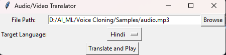

# Voice-Cloning

This is a simple Python application that translates and plays audio or video files into different languages using Google Translate and text-to-speech (TTS) synthesis.

## Sample Output

## Prerequisites

Before running the application, ensure you have the following Python packages installed:

- deep_translator
- gtts
- playsound
- moviepy
- speech_recognition
- pydub

## Features

- **Browse and Select:** Easily navigate and choose audio or video files.

- **Choose Target Language:** Select the desired language from a list of options.

- **Translate and Play:** Effortlessly translate and play the audio or video in the selected language.

- **Supports Both Audio and Video:** The application is versatile and supports both audio and video file formats.

## Notes

- The application assumes the input file is either audio or video. Adjust the `media_type` variable in the code accordingly.

- Google Translate API may have usage limitations. Ensure that you are aware of and compliant with any API usage policies.

- If you encounter issues with the installation of required Python packages, consider using a virtual environment to manage dependencies.

- Make sure the selected target language is supported by the Google Translate service.

- For video files, the application extracts audio and translates it. Ensure that your video files have clear and understandable audio content for accurate translation.

- The application may produce better results with high-quality audio recordings.

- Feel free to contribute to the project by submitting bug reports, feature requests, or pull requests.

